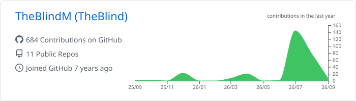
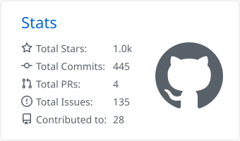
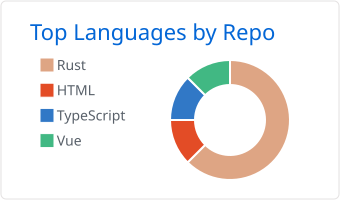

# Hi, I'm TheBlind 👋

### Rust / Tauri builder · Developer tools · AI agents · Security engineering

  用 Rust 和 Tauri 构建桌面应用、终端工具与 AI 实验。 
  Building practical desktop apps, terminal tools, and local-first software.

  
  
  

## 🧭 About me

- 🌊 Currently building [**QuotaTide**](https://github.com/TheBlindM/QuotaTide), a local-first desktop companion for understanding Codex quota.
- 🖥️ Interested in cross-platform desktop software, terminals, SSH workflows, and developer experience.
- 🦀 Exploring Rust across AI tooling, asynchronous systems, and authorized security assessment.
- 💡 I like turning complicated system state into tools that are easy to understand and use.

<h2>🚀 Featured projects</h2>

<table>
  <tr>
    <td width="50%" valign="top">
      <h3><a href="https://github.com/TheBlindM/QuotaTide">🌊 QuotaTide</a></h3>
      
A local-first macOS and Windows tray app that turns the Codex seven-day quota window into an understandable daily budget.

      
<code>Rust</code> <code>Tauri 2</code> <code>TypeScript</code> <code>Preact</code>

    </td>
    <td width="50%" valign="top">
      <h3><a href="https://github.com/TheBlindM/T-Shell">⌨️ T-Shell</a></h3>
      
A configurable terminal emulator and SSH client with reusable quick commands, SFTP, and a focused remote workflow.

      
<code>Vue</code> <code>TypeScript</code> <code>Java</code> <code>Rust</code>

    </td>
  </tr>
  <tr>
    <td width="50%" valign="top">
      <h3><a href="https://github.com/TheBlindM/Tyan">🛡️ Tyan</a></h3>
      
A high-concurrency Rust toolkit for host discovery, port scanning, fingerprinting, and authorized internal-network assessment.

      
<code>Rust</code> <code>Tokio</code> <code>CLI</code> <code>Security</code>

    </td>
    <td width="50%" valign="top">
      <h3><a href="https://github.com/TheBlindM/FC-Rust">🤖 FC-Rust</a></h3>
      
An experiment in connecting Gemini function calling with local command-line tools through a small Rust application.

      
<code>Rust</code> <code>Gemini</code> <code>Function calling</code> <code>CLI</code>

    </td>
  </tr>
</table>

<a href="https://github.com/TheBlindM?tab=repositories"><strong>View all repositories →</strong></a>

<h2>🛠️ Tools I work with</h2>

  
  
  
  
  
  

<h2>📊 Stats and activity</h2>

  

  
  

Language statistics describe the makeup of public code, not experience or proficiency.

<em>Build useful things. Keep learning.</em>

